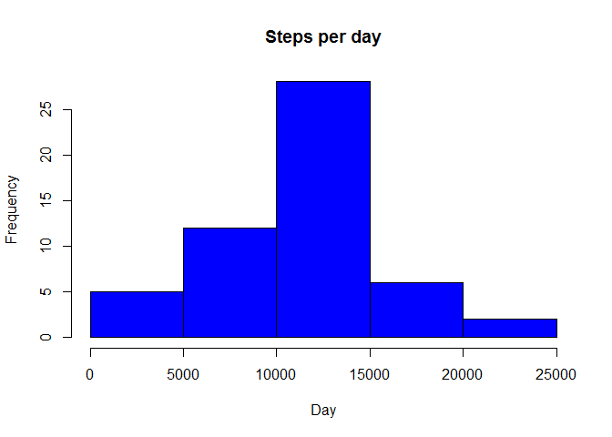
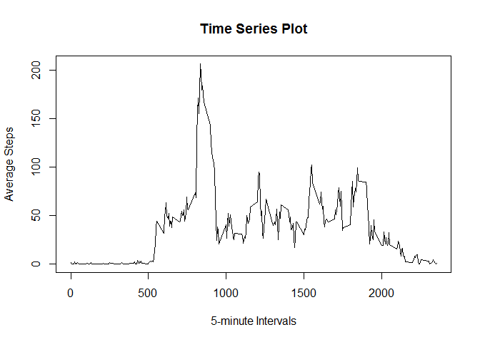
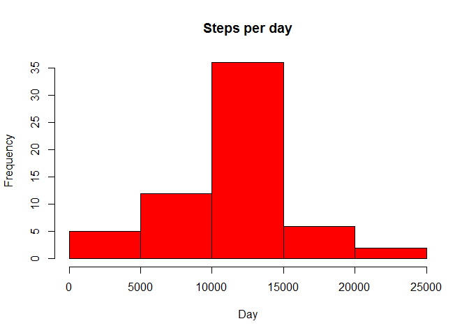

# Reproducible Research: Peer Assessment 1
## Introduction
This assignment makes use of data from a personal activity monitoring device. This device collects data at 5 minute intervals through out the day. The data consists of two months of data from an anonymous individual collected during the months of October and November, 2012 and include the number of steps taken in 5 minute intervals each day.

## Data Source

**Dataset**:  https://d396qusza40orc.cloudfront.net/repdata%2Fdata%2Factivity.zip

**Variables**: 

* steps: Number of steps taking in a 5-minute interval (missing values are coded as NA)
* date: The date on which the measurement was taken in YYYY-MM-DD format
* interval: Identifier for the 5-minute interval in which measurement was taken


## Loading and preprocessing the data

### Reading the data from the file


```r
activity <- read.csv("activity.csv", colClasses = c("numeric", "character", "numeric"))
head(activity)
```

```
##   steps       date interval
## 1    NA 2012-10-01        0
## 2    NA 2012-10-01        5
## 3    NA 2012-10-01       10
## 4    NA 2012-10-01       15
## 5    NA 2012-10-01       20
## 6    NA 2012-10-01       25
```
## What is mean total number of steps taken per day?

### First we aggregate the steps for each day

```r
TotalSteps <- aggregate(steps ~ date, data = activity, sum, na.rm = TRUE)
```

###Histogram of total number of steps taken per day

```r
hist(TotalSteps$steps, main = "Steps per day", xlab = "Day", col= "blue")
```

 

### Mean and Median of the Steps per day

```r
mean(TotalSteps$steps)
```

```
## [1] 10766.19
```

```r
median(TotalSteps$steps)
```

```
## [1] 10765
```


## What is the average daily activity pattern?

### Time Series Plot, Interval with Max number of steps


```r
IntervalStepsAvg <- aggregate(steps ~ interval, data = activity, FUN = function(x) {mean(x, na.rm = TRUE)})

plot(IntervalStepsAvg$interval, IntervalStepsAvg$steps, type="l", main = "Time Series Plot", xlab="5-minute Intervals", ylab="Average Steps")
```

 


### Index value of the interval with max number of Steps


```r
index<- which.max(IntervalStepsAvg$steps)
IntervalStepsAvg[index,1]
```

```
## [1] 835
```


## Imputing missing values
### The total number of missing values in the dataset (i.e. the total number of rows with NAs)

```r
sum(is.na(activity))
```

```
## [1] 2304
```

### Strategy for filling in all of the missing values in the dataset.As a strategy for filling in the missing values in the dataset, I will be using the mean of the specific 5-minute interval in which the observation is missing.

```r
ImputedActivity<-activity
for (i in 1:length(ImputedActivity$steps)) {
    if (is.na(ImputedActivity[i, 1])) {
        averageSteps <- subset(IntervalStepsAvg, IntervalStepsAvg$interval == as.numeric(ImputedActivity[i,3]))$steps
        
        ImputedActivity[i, 1] <- averageSteps
    } 
}
```

### Now, using the Imputed data set, let's make a histogram of the total number of steps taken each day and calculate the mean and median total number of steps.


```r
TotalSteps <- aggregate(steps ~ date, data = ImputedActivity, sum, na.rm = TRUE)
hist(TotalSteps$steps, main = "Steps per day", xlab = "Day", col= "red")
```

 

```r
mean(TotalSteps$steps)
```

```
## [1] 10766.19
```

```r
median(TotalSteps$steps)
```

```
## [1] 10766.19
```

**The value for mean in my new file is the same in as the original file. The median for my new file is now the same as the mean. Imputing missing data for missing data increased the number of steps taken per day.**

## Are there differences in activity patterns between weekdays and weekends?

###Create a new factor variable in the dataset with two levels weekday and weekend indicating whether a given date is a weekday or weekend day.


```r
day <- weekdays(as.Date(ImputedActivity$date))
daylevel <- vector()
for (i in 1:nrow(ImputedActivity)) {
   if (day[i] %in% c("Saturday", "Sunday")) {
        daylevel[i] <- "Weekend"
    } 
    else {
        daylevel[i] <- "Weekday"
    }
}
ImputedActivity$daylevel <- daylevel
ImputedActivity$daylevel <- factor(ImputedActivity$daylevel)

stepsByDay <- aggregate(steps ~ interval + daylevel, data = ImputedActivity, mean)
names(stepsByDay) <- c("interval", "daylevel", "steps")
```

###Make a panel plot containing a time series plot (i.e. type = “l”) of the 5-minute interval (x-axis) and the average number of steps taken, averaged across all weekday days or weekend days (y-axis). 


```r
library(lattice)
xyplot(steps ~ interval | daylevel, stepsByDay, type = "l", layout = c(1, 2), 
    xlab = "Interval", ylab = "Number of steps")
```

 

